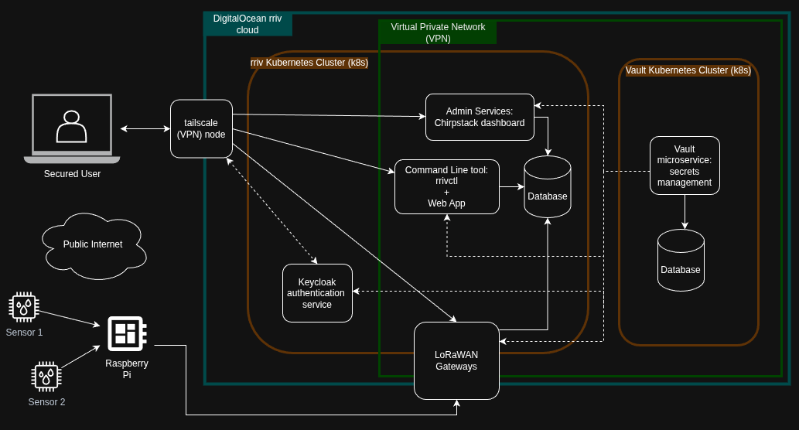
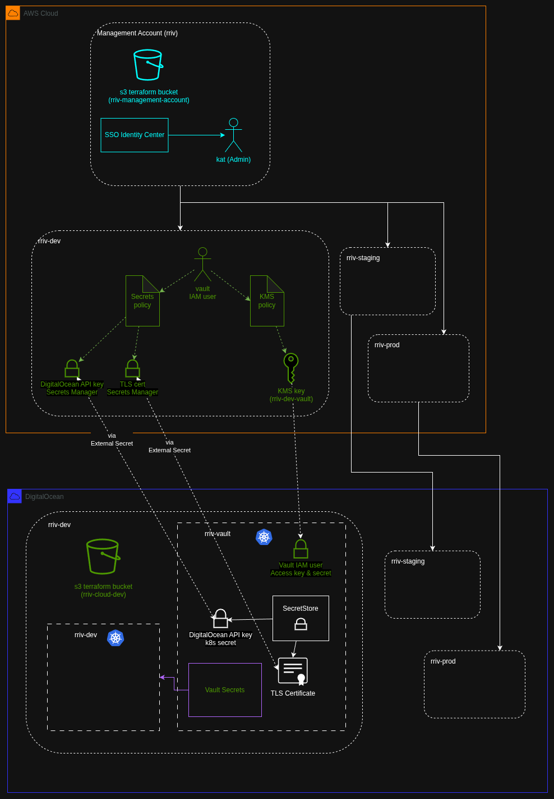

# rriv cloud
*Kubernetes infrastructure for rriv's IoT cloud*

Authors: 
- [Kat Leipper](https://github.com/katherinel)

### What is rriv?

An open source platform for environmental sensor testbed implementation and management.

rriv provides a cloud-based layer for inventory, configuration, and automated performance/event tracking so that teams can reliably test and iterate on new sensing hardware in real-world conditions. It reduces the friction of deploying and validating new sensing hardware by replacing ad-hoc workflows with a scalable, standardized information system.

This repository acts as a monorepo for the cloud layer - everything after the raw data is captured by a LoRaWAN device and passed along to the Internet.

But it doesn’t just provide software - it shows you how to structure your entire cloud setup, including organizing environments, managing your organization, and controlling contributor access, so you can follow a consistent, scalable approach instead of figuring it out piecemeal.



*This diagram is a simplified view of what's involved in the platform from the perspective of an end user.*

## Prerequisites

- **Proton Pass** - (recommended) for storing credentials to various accounts
- **DigitalOcean** - this is where our cloud lives
- **Tailscale VPN** - this is the VPN that gatekeeps some of our infrastructure
- **[kubectl](https://kubernetes.io/docs/reference/kubectl/introduction/)** - k8s CLI tool
- **[Helm](https://helm.sh/)** and **[Helmfile](https://helmfile.readthedocs.io/en/latest/#installation)** - Kubernetes templating
- **[Helm Diff Plugin](https://github.com/databus23/helm-diff)** installed:
`helm plugin install https://github.com/databus23/helm-diff`
- [**doctl**](https://github.com/digitalocean/doctl) - CLI tool for DigitalOcean
- **[Terraform](https://developer.hashicorp.com/terraform/install)** - IaC for our multi-cloud environment
- **AWS CLI** - Not required, but helpful

## Background
RRIV cloud is set up to use DigitalOcean (DO) for its Chirpstack servers. Its main database is a Postgres managed db, also in DO. There are two k8s clusters for each environment - one for the project, and one for the Vault secrets.

We use helm for configuring the k8s clusters. Additionally, the DO infrastructure is captured in Terraform. The Terraform statefiles live in DO.

AWS is used sparingly. Its main purpose is to act as the guardian of our Vault root token. For this, we have some very basic infrastructure captured in Terraform as well, stored again in DigitalOcean statefiles.



*This diagram shows where each piece of infrastructure lives, and where various resources retrieve data/access from.*

## How this repo is organized

There are 4 "phases" in `./infra/phases`. These must be built in order. See the README in each directory for a more in depth description of what the phases do. 

- **Phase 0: Bootstrap AWS**: AWS (specifically, KMS) is used as a place to store Vault (our secrets manager)'s root token.
- **Phase 1: Core Infra**: Creates the networking in DigitalOcean and sets up the Kubernetes clusters.
- **Phase 2: App Platform**: Helm charts that install the various Kubernetes services needed to get the clusters up and running.
- **Phase 3: Services**: Configures some of the core application services, such as Keycloak (authentication) and Chirpstack (device data collection & UI).

## How-Tos

Each infra phase contains a README that explains initial setup as well as development workflow.

There are a handful of resources that have been set up manually. If you are setting up your own project, you will need to create these yourself in your own cloud provider accounts. See the bootstrap phase for more information:
- An infrastructure management AWS account (ours is named `rriv`)
- AWS S3 bucket in the `rriv` account for the initial AWS Terraform statefile
- 4 DO Teams linked to the same organization: `rriv-management`, `rriv-dev`, `rriv-staging`, `rriv-prod`
- DO S3 bucket in each of the dev, staging, and prod team accounts - for storing the Terraform statefiles
- DO S3 bucket access key with read/write/delete on the above S3 buckets (limited scope, and unable to be created with Terraform)


### General development environment setup

TBD

### doctl
It is extremely useful to set up DigitalOcean's CLI, `doctl`. See DO's documentation for using the package manager of your choice.

Log in to DO on the web. Go to the [API tokens page](https://cloud.digitalocean.com/account/api/tokens) and create a new **Personal Access Token**. Give it an expiration of 90 days (for security purposes, we don't want to create forever tokens). Give it full access, as you will need to be able to touch most different kinds of resources in order to develop in DO. **Save** the PAT in your personal Proton Pass vault.

With the PAT copied, run `doctl auth init --context rriv-dev`. Paste in the token. You will need to come back and do this step with each team (account) you plan to develop in.

Now run: `doctl kubernetes cluster list`. You should see the rriv-dev cluster and the vault-dev clusters.

You should now be able to run `kubectl get no` and see the DO droplets.


## Chirpstack k8s
The k8s files were generated from [this](https://github.com/chirpstack/chirpstack-docker) chirpstack-docker project.

The Chirpstack Gateway Bridge receives packets from LoRaWAN devices in the field. Currently we are hardcoded to a single channel plan, us915_1. In order to use multiple channel plans, we need to run separate gateway bridges with their own ClusterIp services, and route to them behind an nginx loadbalancer.

### Credentials
Admin credentials are stored in ProtonPass. Have an admin create an account for you.

## Vault

Vault is installed in a separate k8s cluster from the rriv main app. To switch over:
```
kubectl config get-contexts
kubectl config use-context <vault-context-name>
```
This should update the current cluster to be the one containing Vault. Note that to access k8s using kubectl, you will need a kubeconfig file, which is generated by Phase 1.

The Vault cluster is maintained in its own helmfil, as a separate release. The environments directory takes care of pointing to the correct cluster when updating Vault.

### How it works

The Vault agent injects secrets into pods that are specified via annotations. For an example of this, look at the Chirpstack deployment file. Secrets are injected into `/vault/secrets/credentials`, then used by the container. This centralizes secrets across cloud resources and keeps them out of plaintext k8s.

The secrets needed by Chirpstack are:
```
POSTGRES_CONN_STRING        # Chirpstack's database connection string
PG_INTEGRATION_CONN_STRING  # The TimescaleDB database that Chirpstack pipes data into
```
### Command line

Install the CLI tool via the package manager of your choice: https://developer.hashicorp.com/vault/install

With your kubectl context set to the Vault cluster (see above), forward traffic to localhost:
```
kubectl port-forward svc/vault -n vault 8200:8200
```
In another terminal:
```
export VAULT_ADDR=http://localhost:8200
export VAULT_TLS_VERIFY=false
vault secrets list
```

## Metrics Server
Installed with: `kubectl apply -f https://github.com/kubernetes-sigs/metrics-server/releases/latest/download/components.yaml`


## Queue
The message queue uses [nats](https://docs.nats.io/running-a-nats-service/nats-kubernetes). 

TBD: Might need to create the PVC manually with the pvc.yml file.

Modify the consumers in jetstream.yaml as desired. For more info: https://github.com/nats-io/k8s/blob/main/helm/charts/nack/README.md.

To test the sending and receiving of messages:
```
# Run nats-box which includes the NATS management utilities:
kubectl exec -it deploy/nats-box -- /bin/sh -l

# Publish a couple of messages
$ nats req orders.received "order 1"
$ nats req orders.received "order 2"

# Pull first message.
$ nats consumer next mystream my-pull-consumer

# Subscribe to the message stream:
$ nats sub my-push-consumer.orders
```


## Keycloak
Keycloak is used as an identity provider throughout the project. Its purpose is twofold:
1. Authenticate end users who wish to use the rriv monitoring software.
2. Act as an IDP for the VPN, which gates access to certain private backend services, (such as Vault).

Once you have applied the keycloak terraform module, you are ready to log in to keycloak. You may need to also do a helm apply/sync again, in case the certs aren't working yet:
`helmfile -e $ENV sync --selector name=rriv-network`

1. First log in with the `keycloak_username`/`keycloak_password` credentials that are stored in Vault in the `<$ENV>-keycloak-creds` secret. Use these to log in and manually create in the UI a new Client with service accounts activated. 
2. You can leave "OpenID Connect" selected. 
3. Give the client the name "terraform". 
4. Turn on "Client Authentication" and make sure that the following are checked: "OAuth 2.0 Device Authorization Grant", "Direct access grants", and "Service accounts roles". Root URL and Home URL should be set: "https://auth.<$ENV>.rriv.org". 
5. Put the credentials in your local secrets file so that terraform can use it to create a "rriv-beta" realm. 
6. Under the "Service accounts roles" tab, select "Assign role" > "Filter by realm roles" > select "admin" > Save. 
From here, once you have applied the keycloak module terraform, you can log in and create users.

## Terraform
You must authenticate with DO and AWS before running terraform. Use `doctl` to authenticate to DO.

For AWS, you need an SSO user. After logging in, you will have the option to retrieve access/secret keys. Paste these into your terminal and run `aws sts get-caller-identity` to verify that you are logged in as a user with an admin role.

### A note about the kubernets cluster resource node_size variable

To update the node_size variable in the k8s-cluster module, you must NOT allow the cluster to be destroyed. This is a shortcoming of the current setup. Upgrade each node one at a time to the new size, and change the node_size value to reflect the changes when you are done. Vault data is persisted in k8s persistent volumes, but currently, they will be destroyed if the entire cluster is destroyed. Having the nodes come back up one at a time ensures that there is always a leader node that can pass the data along.