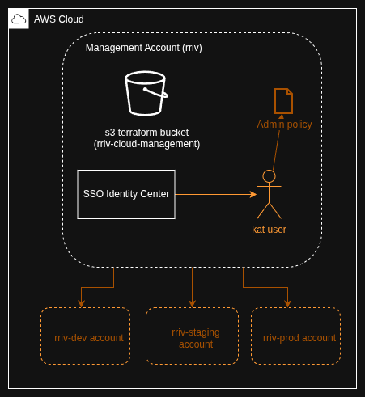

## [Phase 0] Bootstrap AWS

This phase must be applied before any other Terraform. It creates 3 AWS organizations (accounts) & IAM SSO.

This document covers:
- **[What gets built here](#what-gets-built-here)**
- **[First time setup](#first-time-setup)**
- **[Standard Terraform workflow](#standard-terraform-workflow)**

#### Terraform Providers
- aws

----

### What gets built here

Orange parts are what get built by Terraform. Everything else is created manually.



----

### First time setup

1. **AWS Org Account**: In your web browser, create an AWS account. This will be your main org account (management account) that administers each environment account (dev, staging, and prod).

2. **Enable IAM Identity Center**: Go to IAM Identity Center in the AWS Console and enable it. This is a one-time manual step that cannot be done via Terraform.

3. **Statefile bucket**: In S3, create a bucket to contain the statefile for this phase. The name should match what's in the `terraform.tf file`. Recommended: Enable bucket versioning & tag the bucket with `iac = null` to indicate that it was created outside of IaC.

4. **Create temp IAM user for Terraform**:
  - Go to IAM → Users → Create user
  - Name it something like `terraform-bootstrap` or `terraform-admin`
  - Attach the `AdministratorAccess` policy (or a custom policy with permissions for Organizations and IAM Identity Center)
  - Go to the Security credentials tab → Create access key
  - Choose "Command Line Interface (CLI)" as the use case
  - **Copy the Secret Access Key immediately** - you won't be able to see the secret again*. Export it to your terminal:
  ```bash
   export AWS_ACCESS_KEY_ID="your-access-key-id"
   export AWS_SECRET_ACCESS_KEY="your-secret-access-key"
   ```

5. **Run Terraform**:
   ```bash
   cd <this directory>/account-setup
   terraform init   
   terraform plan
   terraform apply
   ```

6. **Delete bootstrap IAM user**: Once your resources are successfully created (An identity store user and 3 new linked AWS accounts) you can delete the IAM user you created earlier. Two things you should test before deleting: log in with the "kat" user, and make sure that the S3 bucket has been populated with a statefile. Get the Identity Store login URL from the AWS web console and save it in Proton Pass.

**Note**: After Terraform creates the initial "kat" SSO user and assigns it to dev/staging/prod accounts, you can use SSO to access those accounts. But for running this bootstrap Terraform, you need IAM credentials in the management account.

----

### Standard Terraform workflow

The normal workflow for subsequently applying changes after initial setup is as follows:

1. Log into the AWS console with your SSO user (the "kat" user or whatever you renamed it to).
2. Select the org management account. Click on "Access keys"
3. Copy the temporary access key and secret and export them in your terminal ("Option 1: Set AWS environment variables"). The default TTL for these keys is 12 hours. After that you will have to log in again and get a new access key & secret.
4. `cd <this directory>/account-setup`
5. Run terraform commands

**Note**: If you then go on to do work in a different infra phase, you will need credentials from a different AWS account, depending on the environment.
