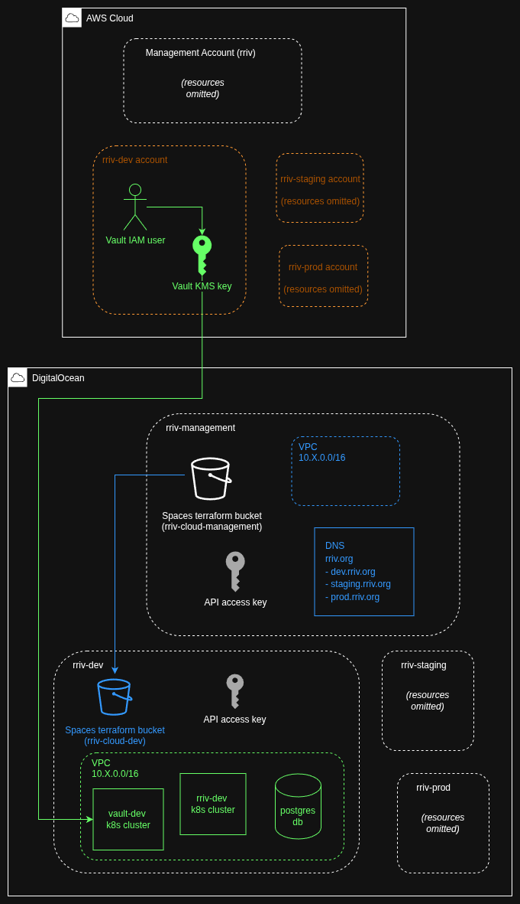

## [Phase 1] Core Infra

This phase must be applied after the bootstrap phase, and before the helm charts are installed. It contains the necessary resources to create the VPCs, Postgres DB, a KMS key to manage the Vault root key, and two k8s clusters (one for the main app, one for the Vault secrets). In the final step, helm is installed in the clusters.

This document covers:
- **[What gets built here](#what-gets-built-here)**
- **[First time setup](#first-time-setup)**
- **[Standard Terraform workflow](#standard-terraform-workflow)**

#### Terraform Providers
- digitalocean
- aws

----

### What gets built here

Blue parts are build by the management team Terraform (`./environments/management`). Note that the rriv-dev, -staging, and -prod statefile buckets in their respective DO Teams are maintained by the tf here.

Green parts are what live in the dev environment statefile.

Orange parts were covered in the bootstrap module. Everything else exists outside of IaC.



- **AWS rriv-dev**:
     - **Vault IAM user & KMS key**: Used as the root token for instantiating Vault - i.e. "the key that unlocks all the other keys". AWS KMS was chosen because DO does not support KMS, and a DIY open source implementation like [Cosmian](https://github.com/Cosmian/kms) is out of scope for now.
- **DigitalOcean rriv-management**
     - **API Access Key**: Gives tf access to creating resources in this Team
     - **VPC**: Used later for housing the VPN
     - **DNS**: Where the rriv.org domain name is managed, as well as all subdomains.
- **DigitalOcean rriv-dev**:
     - **API Access Key**: Gives tf access to creating resources in this Team
     - **Postgres DB**: Used by the main application
     - **rriv-dev k8s cluster**: Main application
     - **vault-dev k8s cluster**: k8s cluster for secrets management of the entire application using [Vault](https://www.hashicorp.com/en/products/vault).
- **Other envs**: For brevity, I have not shown staging & prod because they are identical to dev.

----

### First time setup

DigitalOcean does not have the same API-accessible account creation available in the way that AWS does. Therefore, after creating an initial account, each "Team" must be created manually.

1. Create your DigitalOcean account. You can choose to create an Organization, or you can forego this step for now. In either case, manually create 4 Teams:
   - rriv-management
   - rriv-dev
   - rriv-staging
   - rriv-prod
2. In each Team, go to Settings → API → Tokens tab → Generate New Token. Give it a name like "terraform". Recommended: Set an expiration of 90 days (meaning you will periodically need to recreate it). Give it full access - Terraform needs access to most resources in the list. Copy this token (you can save it in your password manager).
3. Open the .zshrc.example file at the root of this project. Save each token in your own .zshrc for each team like this: `MGMT_DO_TOKEN=your_token_here` etc
4. In the management team, create a Spaces Object Storage Bucket. This should match what's in `<this directory>/environments/management/terraform.tf` for the `backend "s3"` settings.
5. Get an access key and secret key for the bucket under the bucket's Settings. Limit access to just this bucket. Save these keys in your .zshrc as:
```bash
MGMT_AWS_ACCESS_KEY_ID=your-access-key
MGMT_AWS_SECRET_KEY=your-secret-key
```

5. terraform init:
```bash
cd <this directory>/environments/management
terraform init \
  -var="do_token=$MGMT_DO_TOKEN" \
  -var="aws_access_key_id=$MGMT_AWS_ACCESS_KEY_ID" \
  -var="aws_secret_access_key=$MGMT_AWS_SECRET_ACCESS_KEY"
```


----

### Standard Terraform workflow

```bash
terraform apply -var="do_token=$<ENV>_DO_TOKEN" # replace <ENV>
```