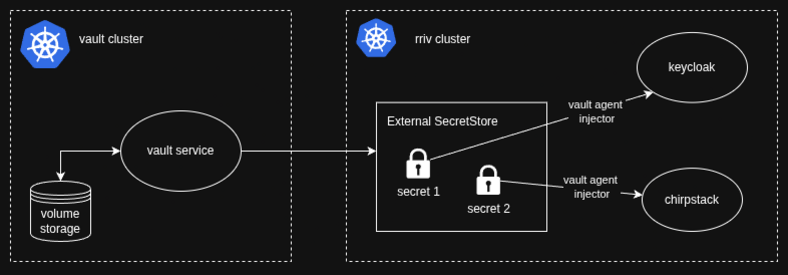

## [Phase 2] App Platform

Helm and helmfile are used to create resources off of templates in the two k8s clusters. The Vault cluster is configured first.

This document covers:
- **[What gets built here](#what-gets-built-here)**
- **[First time setup](#first-time-setup)**
- **[Standard Helm workflow](#standard-helm-workflow)**

----

### What gets built here



#### Vault cluster

- External charts:
   - **cert-manager**: Creates and installs certs with Let's Encrypt
   - **external-secrets**: Allows Vault secrets to be copied into a Secret Store in k8s that is kept in sync
   - **vault-secrets-operator**: Allows pods to consume Vault secrets natively from k8s Secrets

- Custom charts:
   - **rriv-vault**: Vault implementation

#### rriv cluster

- External charts:
   - **external-secrets**: See above
   - **vault-agent-injector**: Adds Vault agents to pods so that secrets can be consumed

- Custom charts:
   - **rriv-external-vault-connect**: Makes Vault cluster endpoint available as a service
   - **rriv-ingress-nginx**: Custom ingress controller
   - **rriv-network**: Networking resources
   - **rriv-keycloak**: Keycloak implementation for authentication
   - **rriv-chirpstack**: Chirpstack implementation for accessing device data

----

### First time setup

#### Prerequisites (see project README)

- helm
- helmfile
- kubectl
- vault

#### 1. Install Vault cluster charts

You will need the kubeconfig environment variable that was output by the previous infra phase. See the example of how to set up your environment in `.zshrc.example`, (i.e. `export KUBECONFIG=...`).

Start with creating vault in the dev environment:

```bash
cd <this directory>/helm && \
helmfile -e dev -f ./helmfiles/vault.yaml.gotmpl apply
```

Switch to the correct k8s context and check that the pods come up and are all running with:
```bash
kubectl config use-context do-sfo2-vault-dev
kubectl get po -A
```

#### 2. Unseal Vault

Vault is set to auto-unseal via AWS KMS keys. This means that as vault pods go down, they come back up without needing to be manually unsealed. However, the first time vault is installed, manual unseal is required. To do this:
```bash
$ kubectl exec -it rriv-vault-0 -n vault -- /bin/sh
# From within the vault pod:
/ $ export VAULT_ADDR="https://127.0.0.1:8200"
/ $ export VAULT_SKIP_VERIFY=true
/ $ vault status # check your connection
Key                      Value
---                      -----
Seal Type                awskms
Recovery Seal Type       n/a
Initialized              false
Sealed                   true
...

# Unseal vault
# See notes about key shares & threshold below before running
/ $ vault operator init -key-shares=3 -key-threshold=2
Recovery Key 1: ...
Recovery Key 2: ...
Recovery Key 3: ...
Recovery Key 4: ...
Recovery Key 5: ...

Initial Root Token: ...

Success! Vault is initialized
...
```
(If any of this errors, try adding the flag: `-tls-skip-verify`)

After this, it is **critical** that you write down the recovery keys and root token. **SAVE** these in Proton Pass. Save one of the recovery keys and distribute the other 2 to two other project admins (*note: they don't need to be highly technical contributors, they just need to be able to reliably store a key*). If the vault ever needs to be re-keyed, you can do so by entering 2 of the 3 recovery keys ("shards"). In doing this, you ensure that no single person can re-key the vault.

Now, if the vault pod goes down, it should be able to come up and unseal itself. Test this by deleting the pod and checking its logs.

Once you have Vault installed, you will need to create a temporary token in order to set up the Vault auth method for k8s. This is so that you are not using the root token for operations while developing. Refer to scripts/vault-kubernetes.sh. (TODO: this section is incomplete)

#### 3. Install rriv cluster charts

```bash
cd <this directory>/helm && \
helmfile -e dev -f ./helmfiles/rriv.yaml.gotmpl apply
```

This will take a few minutes to come up, as the cert need to be installed. If any part of the helm install fails, wait until the cert looks good:

```bash
kubectl config use-context do-sfo2-rriv-dev
kubectl get certificate rriv-dev-org-tls -n default

# Other resources to check if the cert install fails or is stuck:
kubectl get certificaterequest -n default
kubectl get challenges -n default
kubectl get orders -n default
```

#### 4. Set up other environments

Repeat the above steps for your staging and prod environments. They will each have their own separate vault and rriv clusters, in their own DO Teams, isolated from each other.

----

### Standard Helm workflow

```bash
kubectl -e $ENV -f ./helmfiles/$CLUSTER.yaml.gotmpl diff
kubectl -e $ENV -f ./helmfiles/$CLUSTER.yaml.gotmpl apply

# Target a specific chart, e.g. rriv-network:
kubectl -e $ENV -f ./helmfiles/rriv.yaml.gotmpl apply --selector name=rriv-network
```

Check k8s resources:
```bash
kubectl config use-context do-sfo2-$CLUSTER-$ENV
kubectl get po -A
```
If you get "access denied"-type errors, your kubeconfig may be expired. In the previous  infra phase, re-apply the k8s-cluster module in order to regenerate the kubeconfig: `tf apply -target=module.$ENV_do_sfo2_k8s_rriv_cluster` or `tf apply -target=module.$ENV_do_sfo2_k8s_vault_cluster`
