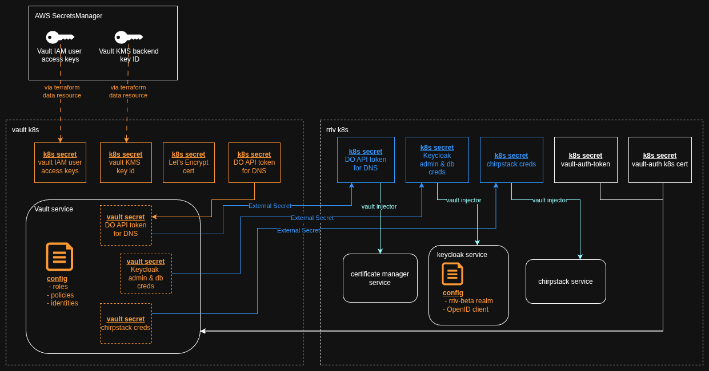

## [Phase 3] Services


This document covers:
- **[What gets built here](#what-gets-built-here)**
- **[First time setup](#first-time-setup)**
- **[Workflow](#workflow)**

#### Terraform Providers
- kubernetes
- aws
- vault
- keycloak

----

### What gets built here

Below in orange are the resources built by this phase.

Blue indicates autonomously created resources via a combination of External Secrets and the Vault agent pod injector.



- **Vault cluster secrets**: Kubernetes secrets containing the Vault KMS key id, access key & secret key for the Vault IAM user, DO API key for configuring DNS, and the SSL cert itself.
- **rriv cluster secrets**: No resources are created; the vault-auth-token (created in the previous infra phase via helm) that lets k8s pods authenticate to Vault is output from a data resource.
- **Vault configuration**: Creates a new key-value store and populates it with username/password admin logins for Keycloak & Chirpstack, credentials for the app's Postgres database, and a DO API key for configuring DNS. (TODO: VPN secrets)
- **Keycloak configuration**: Sets up a new keycloak Realm with users and policies.

----

### First time setup

You need to pass in the following variables to Terraform:
- `TF_VAR_do_token`: DO API token for executing terraform actions (can use the one created in a previous infra phase)
- `TF_VAR_vault_token`: An admin token generated by Vault (don't use the root token)

Save these to your terminal env.

```bash
terraform init -backend-config=
```

 After running,

### Workflow

If everything is working correctly up to this point, installing this phase should be as simple as running a `terraform apply` inside of the environment directory.
